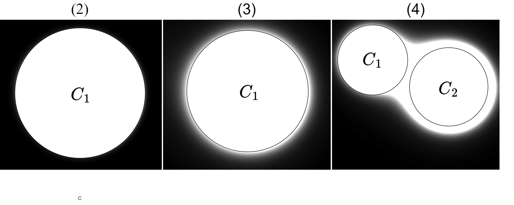
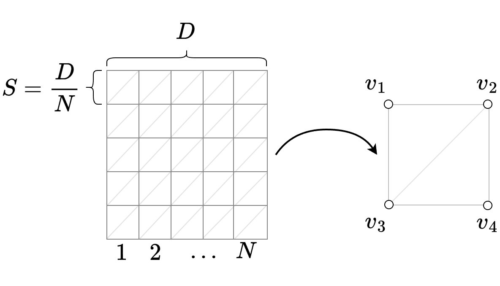

## 2D Metaballs in WebGL
Live demo at: https://jako-k.github.io/metaballs-2D/


https://github.com/user-attachments/assets/b877e1a0-acbd-4165-b664-ef4a1242e23d

## Theory

Metaballs get their characteristic look by merging boundaries when close. One way of obtaining this look is by starting from the parametric definition of a filled circle (eq. 1):

$$
(x - x_c)^2 + (y - y_c)^2 \le r^2
$$

or (eq. 2)

$$
\frac{r^2}{(x - x_c)^2 + (y - y_c)^2} \ge 1
$$

where $(x, y)$ is an arbitrary Cartesian coordinate, $(x_c, y_c)$ is the circle center, and $r$ is the circle's radius. The inequality sign ensures a circle with perfectly sharp boundaries, where all points inside or exactly on the circle's periphery are valid. By removing the inequality from the second equation, i.e. focusing solely on its left‐hand side, it can function as an inverse Euclidean distance measure, of sorts (eq. 3):

$$
d(x, y, x_c, y_c, r) = \frac{r^2}{(x - x_c)^2 + (y - y_c)^2}
$$

From this, we can deduce that points $(x, y)$ close to $(x_c, y_c)$ will yield larger values, while points farther away will yield smaller values. This fact can be used to construct filled circles with soft boundaries by interpreting the output as intensity or pixel brightness. For a single circle this is all that will happen. But if we accumulate the result of $d(\dots)$ from multiple circles, the characteristic metaball behavior can arise. Mathematically this can be summarized as (eq. 4):

$$
f(x,y) = \sum_{i=0}^{C} d(x, y, x_{i,c}, y_{i,c}, r_i)
$$

where $C$ is the number of circles, $(x_{i,c},y_{i,c})$ is the center of the $i$‑th circle and $r_i$ is its radius.  
Figure 1 provides a visual overview of each step in the described method.

  
**Figure 1:** Overview of equations (2), (3) and (4)

## Implementation

The implementation can be nicely summarized into the five parts seen below.

**Listing 1: Implementation pseudocode**  
```python
# 1.) Setup
initialization(...)
create_grid(D, N) 

while is_running:
    # 2.) User inputs
    has_changed = handle_user_inputs()
    if has_changed:
        update_state()

    # 3.) Movement
    move_balls()

    # 4.) Send data from the CPU to the GPU
    update_webgl_uniforms()

    # 5.) Rendering
    draw_triangles_with_animation_delay()
```

1. **initialization(...)** takes care of setting up WebGL, linking HTML components to JavaScript functions, etc. **create_grid(D, N)** is directly tied to the metaball implementation and will be explained in [Discretization](#discretization).  
2. This part handles communication between user and program. The user can adjust several settings and interactively move the balls around. Details will follow in [User Input](#user-input).  
3. **move_balls()** simulates the movement of balls. The physics is simple: balls move with a constant, predefined velocity which is reversed when hitting a wall.  
4. & 5. These steps contain the most graphically interesting code. They’ll be explained from the vertex shader’s perspective in [GPU and the Vertex Shader](#gpu-and-the-vertex-shader).

### Discretization <a name="discretization"></a>

Determining how the problem can be discretized is essential. We need to translate the mathematical, infinitely precise description into a format that can be processed by the computer and shown on the screen. An obvious solution is to use a simple grid. In theory, this grid could simply be a grid of pixels, but a slightly less detailed and more adjustable grid was chosen instead. Each cell in the grid is represented by a square built from two triangles.  
Figure 2 illustrates how the grid is constructed. $D$ is the pixel dimension of the canvas (width and height are identical), $S$ is the grid size, and $N$ is the number of cells. Each cell is built from two triangles defined by four vertices $v_1$, $v_2$, $v_3$, and $v_4$.

  
**Figure 2:** Overview of the grid.

### GPU and the Vertex Shader <a name="gpu-and-the-vertex-shader"></a>

$f(x,y)$ from equation (4) has a particularly nice property: it is easy to parallelize, since $f(x,y)$ can be calculated independently for each $(x,y)\in\mathbb{R}$. We can therefore effectively utilize the many cores of the GPU. WebGL provides two ways to interact with the graphics card: (1) through the vertex shader, and (2) through the fragment shader. The vertex shader seemed like the obvious choice given the grid described above.  

**Listing 2: Vertex shader pseudocode**  
```glsl
// Note 1: Circle information
uniform vec3 v_circle_xs;
uniform vec3 v_circle_ys;
uniform vec3 v_circle_rs;

// Note 2: Calculate f(x,y) from eq. (4)
int C = 3;
for (int i = 0; i < C; i++) {
    float c_r = v_circle_rs[i];
    float c_x = v_circle_xs[i];
    float c_y = v_circle_ys[i];
    float x_diff = (c_x - x_cartesian);
    float y_diff = (c_y - y_cartesian);
    float denominator = x_diff*x_diff + y_diff*y_diff; 
    float numerator = c_r*c_r; 
    
    // toggle for sharp circle view
    if ((circleViewToggleBool == 1.0) && (denominator <= numerator)) {
        v = 0.0;
        break;
    }  
    
    v += numerator / (denominator + epsilon);
}

gl_Position = vec4(a_position[0], a_position[1], 0.0, 1.0);

// apply glow effect
if (v < 1.0)
    v = pow(v, glow_slider);

// apply color sliders
f_color = vec4(v * r_slider, v * g_slider, v * b_slider, 1.0);
```

### User Interface Controls <a name="user-input"></a>

- **Resolution Slider**  
  Controls $N$, which indirectly controls the cell size $S$.

- **Merge Distance Per Color Channel**  
  Three sliders (Red, Green, Blue) adjust each channel’s contribution by multiplying a scalar on each of the RGB values.

- **Glow Slider**  
  Controls the softness/blurriness of the metaballs by applying an exponent $\alpha$ to $f(x,y)$ for $f(x,y) < 1$:  
  $$f(x,y) \leftarrow f(x,y)^\alpha$$  
  - If $\alpha > 1$, intensity of all but the brightest pixels is lowered (reduced glow).  
  - If $\alpha < 1$, overall brightness increases (enhanced glow).

- **Control Section**  
  Three toggle buttons:  
  1. **Movement**: Toggles whether the balls move.  
  2. **Overlay**: Adds black to pixels that fulfill  
     $$\frac{r^2}{(x - x_c)^2 + (y - y_c)^2} \ge 1$$  
     i.e., pixels within the original circle.  
  3. **Follow**: Lets the user control the largest ball with the mouse.
